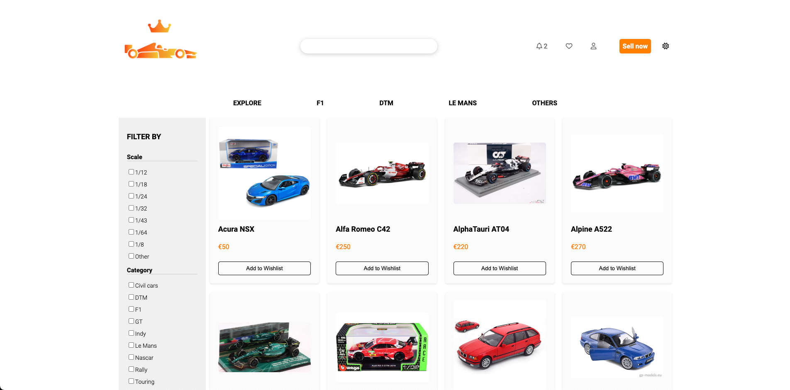
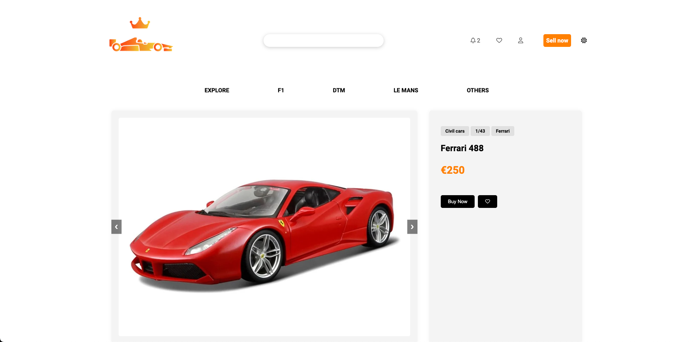
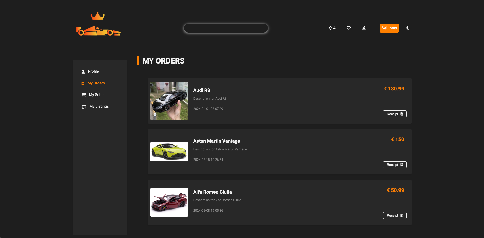
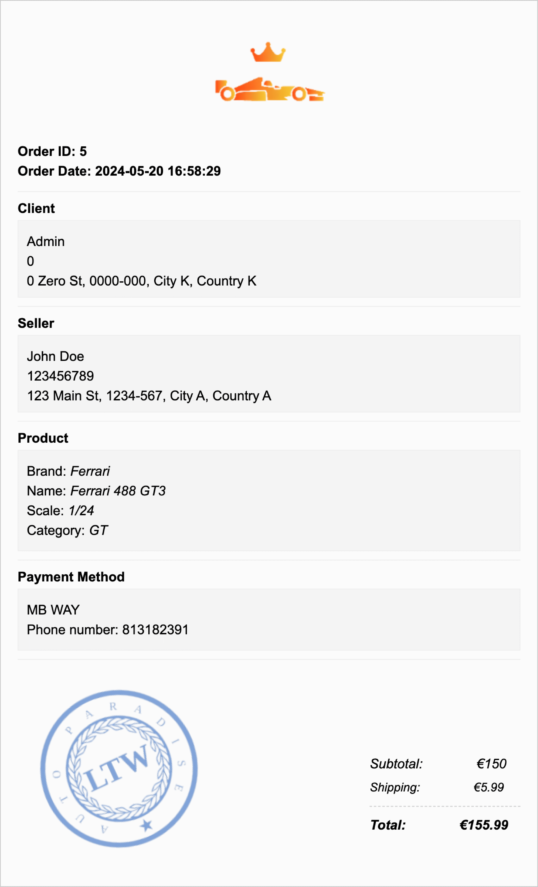

# Auto Paradise

<p align="center"></p>

Auto Paradise is an marketplace dedicated to buying and selling preloved diecast model cars.

The entire project was developed using vanilla CSS, PHP, and JavaScript.

## Install

### Download
```bash
git clone git@github.com:ricardoyang00/auto-paradise.git

cd auto-paradise
```

### Build and run
```bash
# import SQLite database
sqlite3 database/database.db < database/database.sql

# start PHP built-in web server
php -S localhost:9000
```

Access them via web browser at http://localhost:9000

## External Libraries

We have used the following external libraries:

- Font Awesome
- Google Fonts
- jsPDF
- html2canvas

## Implemented Features

**General** :

- [x] Register a new account.
- [x] Log in and out.
- [x] Edit their profile, including their name, password, phone number, and address.

**Sellers**  are able to :

- [x] List new items, providing details such as category, brand, model, size, and condition, along with images.
- [x] Track and manage their listed items.
- [x] Respond to inquiries from buyers regarding their items and add further information if needed.
- [x] Print shipping forms for items that have been sold ( colorful or black and white receipt using `ctrl+p` ).

**Buyers**  are able to :

- [x] Browse items using filters like category, brand, model, and size.
- [x] Engage with sellers to ask questions or negotiate prices.
- [x] Add items to a wishlist.
- [x] Proceed to checkout with their shopping cart (simulate payment process).

**Admins**  are able to :

- [x] Elevate a user to admin status.
- [x] Introduce new item categories, brand, model, size, and other pertinent entities.
- [x] Ban users or products in practical cases of acts against regulations
- [x] Oversee and ensure the smooth operation of the entire system.

💡 **Some account credencials [click here](#account-credentials).**

**Security** :
We have been careful with the following security aspects:

- [x] **SQL injection**
- [x] **Cross-Site Scripting (XSS)**
- [x] **Cross-Site Request Forgery (CSRF)**

**Password Storage Mechanism**: hash_password&verify_password

**Aditional Requirements** :

We also implemented the following additional requirements:

- [x] **Notifications System**  - sales, purchases, questions, answers, system warnings, bans ...
- [x] **Advert System**  - products highlighted at the beginning of the main page (in progress)
- [x] **Shipping Costs (Fixed Amount)**
- [x] **Light/Dark Mode**

## Screenshots


<p align="center" justify="center">
<b><i>Fig 1. Main page</i></b>
<br></br>


<p align="center" justify="center">
<b><i>Fig 2. Products page</i></b>
<br></br>


<p align="center" justify="center">
<b><i>Fig 3. Product details page</i></b>
<br></br>


<p align="center" justify="center">
<b><i>Fig 4. Dark mode</i></b>
<br></br>

<p align="center"></p>
<p align="center" justify="center">
<b><i>Fig 5. Receipt example</i></b>
<br></br>


## Account Credentials
Feel free to use the following test account credentials to explore our platform

| Username | Password  |
| -------- | --------- |
| user1    | password1 |
| user2    | password2 |
| user3    | password3 |
| user4    | password4 |
| user5    | password5 |
| user6    | password6 |
| user7    | password7 |
| user8    | password8 |
| user9    | password9 |
| user10   | password10|
| admin    | admin     |


## Acknowledgements

This project was developed for the "Linguagens e Tecnologias Web" (LTW) course at @FEUP by team ltw06g09 on May 2024:

- Bruno Huang (up202207517)
- Ricardo Yang (up202208465)

Special thanks to Professor [André Restivo](https://sigarra.up.pt/feup/pt/func_geral.formview?p_codigo=353972) for guidance and support throughout the course.

<br>

__© 2024 Auto Paradise, LTW__
